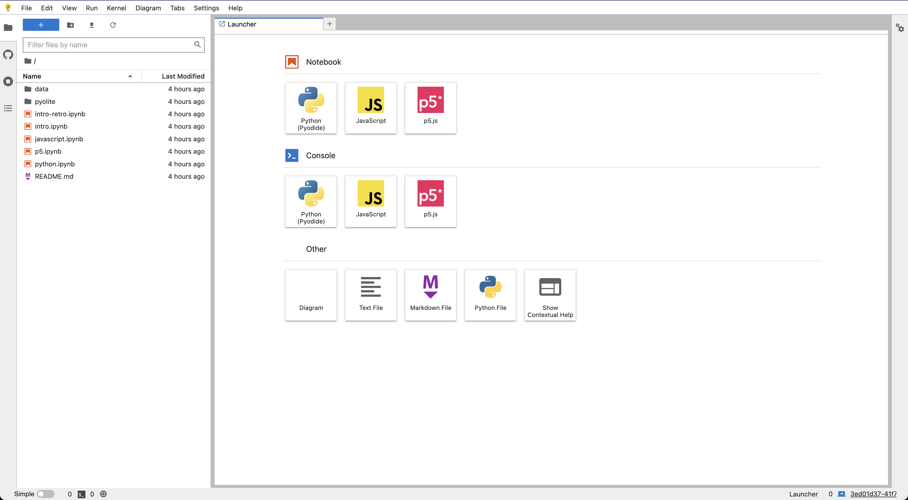

# No Tab Trap on Initial Page

- id: 1wlgh6

## Description

When a user loads the app for the first time, they should be able to use the tab key to
navigate without getting trapped.

## Applicability

Which apps does this test apply to.

- JupyterLab

## Accessibility Criteria

This test is related to:

- [WCAG Success Criterion 2.1.2 No Keyboard Trap](https://www.w3.org/TR/WCAG22/#no-keyboard-trap)

If this test fails, it means the app fails to conform to 2.1.2.

If this test passes, however, it does not mean that the app conforms to 2.1.2. It only means that the app does not violate 2.1.2 for this specific test. This test can be combined with others to increase confidence that the app as a whole conforms to 2.1.2.

## How to Verify the Test Manually

1. Open JupyterLab in a fresh environment. Another way to say this is that you should have the following parts visible: top menu bar, left side panel with file browser open, the launcher in the main area, right side panel closed, and status bar. Here's a screen shot:
  
2. From the top of the page, press the tab key repeatedly.
3. You should be able to cycle back to where you began using only the tab key.
